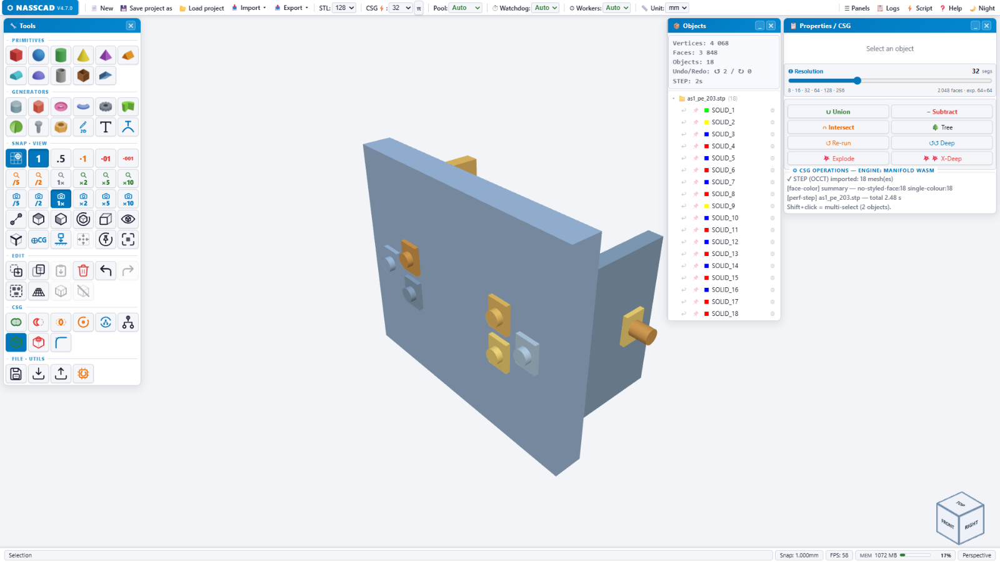

# NASSCAD

**Parametric 3D CAD in your browser, with local processing and no account.**

[Try NASSCAD](https://www.nasscad.com/) · [Download releases](https://github.com/Nx-Nass/NassCAD/releases) · [Report a bug](https://github.com/Nx-Nass/NassCAD/issues) · [Getting started](#getting-started)

Create solids, sketch in 2D, apply fillets and chamfers, and exchange STEP, IFC and mesh files. NASSCAD is a personal project by Nasser / NassLab. Personal, non-commercial and educational use is free under the terms in [LICENSE](LICENSE); commercial use requires an agreement.



*Interface illustration from an earlier 4.7.0 build, before the switch to the MEDUSA engine.*

## Which version should I use?

| Version | Best for | Requirements |
|---|---|---|
| **4.7.0 — MEDUSA** | Current development, STEP / IFC, B-Rep fillets and chamfers | Modern browser and local HTTP server. **MEDUSA must be built and started for boolean operations.** |
| [**4.2.7 — classic**](https://github.com/Nx-Nass/NassCAD/releases/tag/v4.2.7) | The earlier self-contained HTML application | Browser; see the [original setup instructions](https://github.com/Nx-Nass/NassCAD/blob/v4.2.7/README.md). |

This is the canonical repository for NASSCAD. Versions are identified by tags and releases, rather than separate repository names. The histories of the former 4.2.7 and 4.7.0 repositories are retained.

## Getting started

Download a release or clone the current development version:

```bash
git clone https://github.com/Nx-Nass/NassCAD.git
cd NassCAD
python -m http.server 8080
```

Open **http://localhost:8080/NASSCAD_V4_7_0.htm** in your browser. Keep the bundled files together. The current checkout includes the OpenCASCADE WASM and data files.

For Union, Subtraction and Intersection, also extract the build bundle for your platform and follow its instructions to build and start **MEDUSA**. See [the engine guide](#-nasscad-engine--medusa). Viewing, primitives, fillets, chamfers and file import/export work without MEDUSA.

On Windows, `nasscad.bat` can start MEDUSA and open the page once the engine is built; it expects `Nasscad_Medusa_Engine_3.1.exe` beside the application. The build bundles contain source and build instructions, not a ready-to-run engine.

NASSCAD processes models locally. After downloading its components, it can run without an internet connection. A display of **1920×1080 or higher** is recommended.

---
## ✨ What's in 4.7.0

| | |
|---|---|
| **18 watertight primitives** | ArcSphere, Cylind, Cubic, Tore, Gear, Screw, Nut, Pipe, RevSolid, Roof, Hollow box, Gen… |
| **Real fillet & chamfer** | True B-Rep operations via OpenCASCADE, on picked edges or all edges |
| **STEP AP203 / AP214 / AP242** | Import **and** export, with per-part *and* per-face colours read from the file itself |
| **PMI & GD&T** | Product manufacturing information read from STEP assemblies |
| **IFC — BIM read & write** | Opens IFC2X3 / IFC4 / IFC4X3 in the browser (bundled web-ifc engine, offline): every building element as its own object, with its IFC name, colour and real position in mm. Writes **IFC4** with the Project › Site › Building › Storey structure strict BIM software expects — cubes, cylinders, tubes, hollow boxes, spheres and cones as true parametric solids, everything else as triangulated surfaces, colours per face kept |
| **Non-destructive CSG tree** | Union / Subtraction / Intersection keep their construction tree — change a source and Re-run |
| **Native CSG engine** | All booleans run in MEDUSA — C++, multithreaded, on your own machine. **Required**, no browser fallback. Progressive mode: a quick preview first, the full-quality result right after |
| **Build volume** | Your printer's bed and build volume on the grid — **28 best-selling printers** (Bambu Lab, Creality from the original Ender-3 and the Neo to the K2 Plus, Prusa, Elegoo, Anycubic, Voron, Sovol). Only the walls behind the part are drawn; a wall turns red when the part sticks out |
| **World grid** | A gridded room — floor, walls, ceiling — around your work, sized to the scene (1 m, 2 m, 5 m…) so depth and scale read at a glance. One button hides volume + room, the work grid stays |
| **Toolbox** | 6 icons per row. Scale the selection /5 /2 1× ×2 ×5 ×10, set the scroll-wheel zoom speed /5 /2 1× ×2 ×5 ×10 (remembered), measure, frame, drop to ground, centre of gravity… every button documented in the built-in help |
| **Sketch.Gen** | 2D sketcher |
| **Generators** | Screw.Gen & Nut.Gen (ISO / ASME, right- or left-hand thread, print clearance, Higbee cut), Gear.Gen, Pipe.Gen, CircularText.Gen |
| **NassScript** | Full-access JS console over the scene graph — `NASSCAD_bench_perf.js` is a ready-made benchmark to run in it |
| **Undo / Redo** | 200 levels, IndexedDB-persistent |
| **Editing** | Box-select, double-click cycle (resize handles → dimensions → rotation rings), X-Ray mode, magnetic snap down to 0.001 mm |
| **Import** | STL · OBJ · 3MF · GLB · PLY · STEP · IFC |
| **Export** | STL · OBJ · 3MF · GLB · PLY · STEP AP242 · IFC4 · SVG · DXF |

Requires a modern browser with WebGL and WebAssembly: Chrome 90+, Firefox 90+, Safari 16+.

---

## ⏱ Performance — measured

Measured on 23/09/2026 with `NASSCAD_bench_perf.js` on an Intel Core i5-9400 (6 cores), 64 GB RAM, NVIDIA RTX 3050 8 GB, Firefox 152, 1920×1080, NASSCAD Engine 3.1. Booleans scale with the CPU cores, display with the graphics card.

| Test | Result |
|------|--------|
| Display — camera orbit | **60 FPS** up to 1,000 objects (even 16.6 M vertices) · ~30 FPS around 2,000 objects |
| Cube − cylinder · two spheres at CSG⚡ 64 | 0.15 – 0.4 s |
| Two spheres at CSG⚡ 128 · 200 mm plate − 100 holes | 0.4 s · 0.8 s (preview after 0.1 – 0.25 s) |
| Union of 200 spheres that do not touch (fast path, 19.5 M vertices) | 3.6 s |
| Two spheres at CSG⚡ 256 · CSG⚡ 512 | 1.1 s · 4.0 s (preview after 0.1 s) |
| Union of 100 overlapping spheres (3.2 M triangles in) | 12.7 s (preview after 0.5 s) |

---

## 🗂 Repository layout

```
NASSCAD_V4_7_0.htm          Application — the single entry point
nasscad.bat                 Windows launcher: starts MEDUSA, then opens NASSCAD
three.js                    Renderer
nasscad-fonts.js            Bundled typefaces
nasscad-draco.js            Draco codec (GLB/glTF)
nasscad-gens.js             Generators: Sketch, Screw, Nut, Gear, Pipe, CircularText
nasscad-io.js               Import / export pipeline
nasscad-materials.js        Material library
nasscad-buildvolume.js      Build volume (28 printers) and world grid
nasscad_logs.js             Structured logging
nasscad_occt_wasm.js        OCCT glue layer
nassscript.js               NassScript console
nasscript_doc.html          NassScript documentation
occt-import-js.js           occt-import-js bridge
occt-loader-b64.js          OCCT loader
opencascade.wasm.wasm       OpenCASCADE compiled to WebAssembly (66 MB)
opencascade.wasm.data.js    OpenCASCADE data file (88 MB)
quick-fillet.js             Fillet / chamfer (OCCT)
step-import.js              STEP reader
step-export.js              STEP AP242 writer
step-declare.js             STEP declarations
step-xcaf.js                XCAF — colours, PMI, assembly structure
ifc-import.js               IFC reader (web-ifc, in the browser)
ifc-export.js               IFC4 writer
web-ifc-api-iife.js         web-ifc engine
nasscad-ifc-wasm.js         web-ifc WebAssembly, embedded
web-ifc-LICENSE.md          web-ifc license (MPL 2.0)
NASSCAD_bench_perf.js       Performance benchmark (NassScript)
capture_csg.js              CSG payload capture, for engine debugging

MEDUSA_SOURCE/              MEDUSA engine — C++ source (nasscad_medusa.cpp)
DEPLOY_WINDOWS_11_MSVC/     Medusa_Engine_MSVC.zip — MEDUSA, MSVC build (source + CMake + vcpkg)
DEPLOY_UBUNTU_LINUX/        DEPLOY_UBUNTU.zip      — MEDUSA, native Ubuntu installer
DEPLOY_UBUNTU_WSL/          DEPLOY_UBUNTU_WSL.zip  — MEDUSA, WSL deployment
```

---

## 🐙 NASSCAD Engine — MEDUSA

**Required for boolean operations.** Since 4.7.0, `manifold.js` and `manifold_worker.js` are gone: Manifold no longer runs in the browser at all. Every boolean goes to MEDUSA over local HTTP (`POST /csg` for a flat operation, `POST /csgtree` for a whole tree), and reachability is re-probed before each one. There is **no WASM fallback** — with MEDUSA stopped, the engine badge turns red (`MEDUSA OFF`) and the operation stops with an explicit error rather than silently degrading.

MEDUSA is a small native binary that runs **on your own machine** and listens only to it — nothing is uploaded, no account, no remote server. It links Manifold in native C++ with oneTBB, so booleans run at compiled-native speed across your cores instead of single-threaded WASM, and it also does native STEP reading and tessellation.

**Works without MEDUSA** — viewing, the 18 primitives, selection, gizmos, fillet and chamfer, build volume, and import/export of STEP, IFC, STL, OBJ, 3MF, GLB and PLY. All of that runs in the browser (OpenCASCADE and web-ifc in WebAssembly) and needs nothing installed.

**Needs MEDUSA** — Union, Subtraction and Intersection, Deep Re-run of a CSG tree, and auto-union repair.

**23/09/2026 fix** — mesh welding by proximity now probes neighbouring cells by integer index. Spheres centred on a plane at 0 (Z = 0) used to keep one unwelded seam vertex and fail as *NotManifold*; they now union cleanly. The source in all three `DEPLOY_*` bundles carries the fix.

**Engine log — on demand, not on disk.** MEDUSA writes no log file. The last 20 000 lines are kept in memory and served as plain text by `GET /log?n=<max>` — the jellyfish button in the NASSCAD Logs panel pulls them into the panel, next to the browser-side log of the same session. Pass `--logfile` to also write a timestamped `medusa-logs-<date>.txt`, as earlier builds did.

The C++ source is readable in [`MEDUSA_SOURCE/`](MEDUSA_SOURCE/). Build bundles are zipped in the `DEPLOY_*` folders — extract the one for your platform:

| Target | Zip | Contents |
|--------|-----|----------|
| `DEPLOY_WINDOWS_11_MSVC` | `Medusa_Engine_MSVC.zip` | `nasscad_medusa.cpp`, `CMakeLists.txt`, `vcpkg.json`, `build_msvc.bat`, `BUILD.md` |
| `DEPLOY_UBUNTU_LINUX` | `DEPLOY_UBUNTU.zip` | `install-linux.sh`, `nasscad.sh`, desktop launcher + icons, `README-LINUX.md` |
| `DEPLOY_UBUNTU_WSL` | `DEPLOY_UBUNTU_WSL.zip` | `deploy.bat` / `deploy.sh`, `Medusa_Engine_3.1.bat`, uninstallers |

---

## 📦 Third-party components — all local, zero CDN

**In the browser**

| Component | Author | License |
|-----------|--------|---------|
| `three.js` r128 | three.js authors | MIT |
| OpenCASCADE Technology 7.4.0 via opencascade.js 1.1.1 | Open Cascade SAS / Sebastian Alff | LGPL 2.1 with exception |
| `occt-import-js` | Viktor Kovács | LGPL 2.1 |
| `web-ifc` 0.0.77 | That Open Company | MPL 2.0 |
| Draco 1.5.7 | Google | Apache 2.0 |
| `helvetiker` regular / bold | MAGENTA Ltd — MgOpen Modata | MgOpen License |
| `optimer` regular / bold | MAGENTA Ltd — MgOpen Cosmetica | MgOpen License |
| `gentilis` regular / bold | J. Victor Gaultney / SIL International | SIL OFL 1.1 |
| `nasscad_logs.js` | NassLab | CC BY-NC 4.0 |

**In the NASSCAD Engine companion**

| Component | Author | License |
|-----------|--------|---------|
| OpenCASCADE Technology 8.0.1 | Open Cascade SAS | LGPL 2.1 with exception |
| Manifold 3.5.3 | Emmett Lalish and contributors | Apache 2.0 |
| oneTBB 2022.2.0 | Intel / UXL Foundation | Apache 2.0 |
| Clipper2 1.5.4 | Angus Johnson | Boost Software License 1.0 |
| hwloc 2.11.2 | Inria and the Open MPI project | BSD 3-Clause |

Each third-party component stays under its own license. See [`THIRD-PARTY.md`](THIRD-PARTY.md).

---

## 👥 Authors

| Role | |
|------|-|
| **Architect & Tester** | **Nasser** — NassLab, Marseille, France. Vision, direction, critical bug identification, quality standards, field testing, technology pivots. |
| **Developer** | **Claude** — Anthropic. Native CSG engine, watertight primitives, STEP colour decoding verified against the file itself, surgical patches, systematic verification before delivery. |

---

## 📄 License

© 2026 NassLab — Nasser, France

NassLab's own code is distributed under the **Creative Commons BY-NC 4.0** license:

- **Education license — free of charge** — schools (secondary, technical and vocational), their teachers and students, public or private, as well as apprenticeship and training centres, colleges, universities, associations, FabLabs, makerspaces and libraries, may use, install, share and adapt NASSCAD for teaching, learning and research, including in paid training. No registration, nothing to sign. Students and teachers own the models they create. (Additional permission in [`LICENSE`](LICENSE).)
- **Personal and non-commercial use** — free, redistribution allowed with attribution
- **Commercial use** — written agreement required from NassLab

NASSCAD is a personal project, developed by one person on his own time. It doesn't earn its author a single cent.

[Full license →](https://creativecommons.org/licenses/by-nc/4.0/) · [`LICENSE`](LICENSE)

Third-party components listed above are **not** covered by CC BY-NC 4.0 and remain under their respective licenses.

INPI Soleau filings: DSO2026022493 · DSO2026016593 · DSO2026011841 · DSO2026010838

> No implied warranty. The author cannot be held liable for any damage resulting from the use of this software.

---

*NASSCAD — NassLab · Marseille, 2026*
