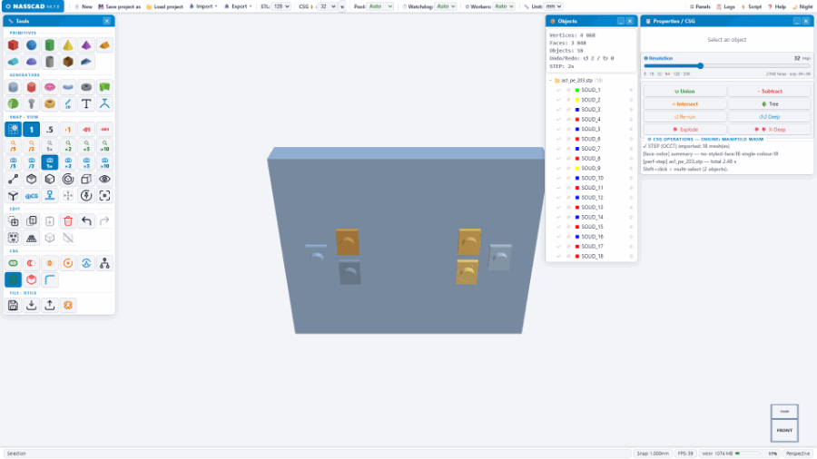
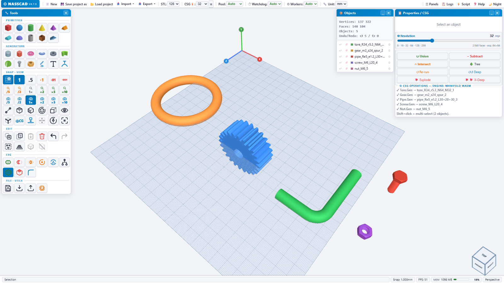
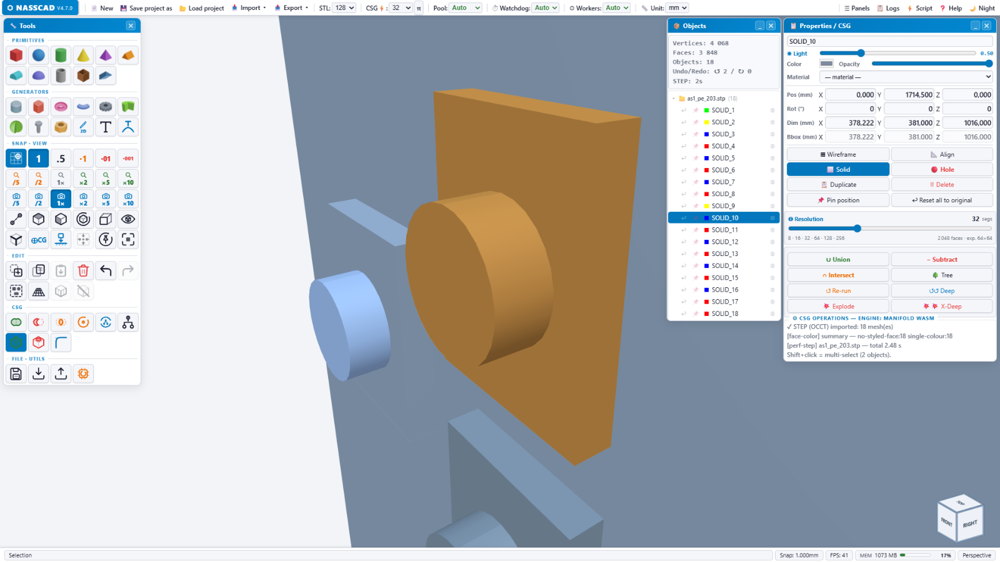

# NASSCAD 4.7.0 — MEDUSA

> Free browser-based parametric 3D CAD — OpenCASCADE WASM · STEP AP242 · PMI · IFC (BIM) · Three.js


[](https://creativecommons.org/licenses/by-nc/4.0/)
[](#-license)
[](https://www.nasscad.com/)
[](https://www.nasscad.com/)
[](https://github.com/Nx-Nass/Nasscad_4.2.7)

**NASSCAD** is a fully offline, browser-based parametric 3D CAD modeler. Design solids, cut them with boolean CSG, import and export native STEP AP242 with PMI, open and write IFC building models. It also opens STL, OBJ, 3MF, GLB and PLY. No server, no install, no login, nothing uploaded. Open the page — it works.

Version 4.7.0 takes its name from its companion. It replaces the local WASM pool of the 4.2.x line with a real B-Rep kernel — **OpenCASCADE** in the browser for STEP, fillet and chamfer — and adds **MEDUSA**, a native engine (C++ / oneTBB) that runs booleans on your own machine when you want them faster.

> **Booleans work in the browser, on their own.** Union, Subtraction and Intersection run on the bundled Manifold WebAssembly build — nothing to install. **MEDUSA is optional**: a native C++ companion that executes the same operations multithreaded, far faster on heavy assemblies. A performance companion, not a prerequisite. See [NASSCAD Engine](#-nasscad-engine--medusa).

---

## ⚡ Quick start

**1 · Try it online — nothing to install, nothing to create**

👉 **[www.nasscad.com](https://www.nasscad.com)**

No install, no account, no upload. Your models stay in your browser.

**2 · Run it offline**

Everything NASSCAD needs ships in this repository, including the two OpenCASCADE WASM binaries. Grab a copy with **Code → Download ZIP**, or take the OCCT runtime and the MEDUSA bundles from the [latest release](https://github.com/Nx-Nass/Nasscad_4.7.0/releases/latest). Unpack it, serve the folder, and you are offline for good — no network call is ever made.

**3 · For developers — clone the repository**

```bash
git clone https://github.com/Nx-Nass/Nasscad_4.7.0.git
cd Nasscad_4.7.0
```

> ⚠️ **The clone is large.** The two OpenCASCADE WASM binaries are versioned in the repository, so a clone pulls roughly **154 MB** of kernel on top of the application. That is deliberate: clone it and it runs, with no asset-fetching step.

> ⚠️ **Serve it, don't double-click it.** WASM streaming and the OCCT data file need a real HTTP origin. Any static server works:
> ```bash
> python -m http.server 8080     # then open http://localhost:8080/NASSCAD_V4_7_0.htm
> ```
> The VS Code Live Server extension works too.

**4 · Optional — build MEDUSA to speed booleans up**

Booleans already work without it. Build MEDUSA when you want them multithreaded and native: each `DEPLOY_*` folder holds one zip (`BUILD.md` for Windows/MSVC, `install-linux.sh` for Ubuntu, `deploy.bat` for WSL). On Windows, `nasscad.bat` starts the engine and opens NASSCAD in one double-click; it expects `Nasscad_Medusa_Engine_3.1.exe` in the same folder as the page. The CSG panel shows which engine is live: `MANIFOLD WASM` in the browser, `· MEDUSA` in green once the native engine answers.

---

## ✨ What's in 4.7.0



| | |
|---|---|
| **18 watertight primitives** | ArcSphere, Cylind, Cubic, Tore, Gear, Screw, Nut, Pipe, RevSolid, Roof, Hollow box, Gen… |
| **Real fillet & chamfer** | True B-Rep operations via OpenCASCADE, on picked edges or all edges |
| **STEP AP203 / AP214 / AP242** | Import **and** export, with per-part *and* per-face colours read from the file itself |
| **PMI & GD&T** | Product manufacturing information read from STEP assemblies |
| **IFC — BIM read & write** | Opens IFC2X3 / IFC4 / IFC4X3 in the browser (bundled web-ifc engine, offline): every building element as its own object, with its IFC name, colour and real position in mm. Writes **IFC4** with the Project › Site › Building › Storey structure strict BIM software expects — cubes, cylinders, tubes, hollow boxes, spheres and cones as true parametric solids, everything else as triangulated surfaces, colours per face kept |
| **Non-destructive CSG tree** | Union / Subtraction / Intersection keep their construction tree — change a source and Re-run |
| **Boolean engine** | Manifold WebAssembly in the browser by default — no install. MEDUSA, the native C++ multithreaded companion, takes over when it is running, with a quick preview first and the full-quality result right after |
| **Build volume** | Your printer's bed and build volume on the grid — **28 best-selling printers** (Bambu Lab, Creality from the original Ender-3 and the Neo to the K2 Plus, Prusa, Elegoo, Anycubic, Voron, Sovol). Only the walls behind the part are drawn; a wall turns red when the part sticks out |
| **World grid** | A gridded room — floor, walls, ceiling — around your work, sized to the scene (1 m, 2 m, 5 m…) so depth and scale read at a glance. One button hides volume + room, the work grid stays |
| **Toolbox** | 6 icons per row. Scale the selection /5 /2 1× ×2 ×5 ×10, set the scroll-wheel zoom speed /5 /2 1× ×2 ×5 ×10 (remembered), measure, frame, drop to ground, centre of gravity… every button documented in the built-in help |
| **Sketch.Gen** | 2D sketcher |
| **Generators** | Screw.Gen & Nut.Gen (ISO / ASME, right- or left-hand thread, print clearance, Higbee cut), Gear.Gen, Pipe.Gen, CircularText.Gen |
| **NassScript** | Full-access JS console over the scene graph — `NASSCAD_bench_perf.js` is a ready-made benchmark to run in it |
| **Undo / Redo** | 200 levels, IndexedDB-persistent |
| **Editing** | Box-select, double-click cycle (resize handles → dimensions → rotation rings), X-Ray mode, magnetic snap down to 0.001 mm |
| **Import** | STL · OBJ · 3MF · GLB · PLY · STEP · IFC |
| **Export** | STL · OBJ · 3MF · GLB · PLY · STEP AP242 · IFC4 · SVG · DXF |

Requires a modern browser with WebGL and WebAssembly: Chrome 90+, Firefox 90+, Safari 16+.

### Parametric generators

Gear, screw, nut, pipe and torus are generated from their parameters — module, tooth count, thread pitch, bend radius — and land on the grid as watertight solids ready to cut, export or print.



---

## 📐 STEP in, parts out

Open a real STEP assembly and every solid arrives as its own object, with its own colour, dimensions and place in the Objects panel — then edit it like anything else you modelled.



---

## ⏱ Performance — measured

Measured on 23/09/2026 with `NASSCAD_bench_perf.js` on an Intel Core i5-9400 (6 cores), 64 GB RAM, NVIDIA RTX 3050 8 GB, Firefox 152, 1920×1080, NASSCAD Engine 3.1. These figures are MEDUSA's: the browser's Manifold WASM path runs the same operations single-threaded, so expect it to be slower on the heavy rows. Booleans scale with the CPU cores, display with the graphics card.

| Test | Result |
|------|--------|
| Display — camera orbit | **60 FPS** up to 1,000 objects (even 16.6 M vertices) · ~30 FPS around 2,000 objects |
| Cube − cylinder · two spheres at CSG⚡ 64 | 0.15 – 0.4 s |
| Two spheres at CSG⚡ 128 · 200 mm plate − 100 holes | 0.4 s · 0.8 s (preview after 0.1 – 0.25 s) |
| Union of 200 spheres that do not touch (fast path, 19.5 M vertices) | 3.6 s |
| Two spheres at CSG⚡ 256 · CSG⚡ 512 | 1.1 s · 4.0 s (preview after 0.1 s) |
| Union of 100 overlapping spheres (3.2 M triangles in) | 12.7 s (preview after 0.5 s) |

---

## 🚦 Status & roadmap

NASSCAD is a personal project, written and maintained by one person. It is used daily and it ships, but it is not a company product and there is no support desk behind it.

**Works today, in the browser alone**

Modelling with the 18 primitives and the generators · fillet and chamfer on real B-Rep edges · booleans on Manifold WebAssembly with a non-destructive CSG tree · STEP AP203/AP214/AP242 import and AP242 export with per-face colours and PMI · IFC2X3/IFC4/IFC4X3 read and IFC4 write · STL, OBJ, 3MF, GLB, PLY in and out · measurement, build volumes for 28 printers, 2D sketcher, NassScript console.

**Works with the optional companion**

MEDUSA runs the same booleans natively in C++ across your cores, with native STEP reading and tessellation. It is a speed-up, not a gate.

**In progress**

- Assembly part names from the STEP XCAF layer are read but not yet surfaced in the Objects panel — imported solids currently show as `SOLID_1 … SOLID_n`
- A single ready-to-run offline bundle, so step 2 of the quick start is one download rather than a repository archive
- Broader browser coverage: development targets Chrome and Firefox; Safari is tested far less

**Honest limits**

Large STEP assemblies are limited by browser memory. The CC BY-NC license means commercial use needs a written agreement. Bug reports with the offending file attached are the single most useful thing you can send — see [`CONTRIBUTING.md`](CONTRIBUTING.md).

---

## 🗂 Repository layout

```
NASSCAD_V4_7_0.htm          Application — the single entry point
nasscad.bat                 Windows launcher: starts MEDUSA, then opens NASSCAD
three.js                    Renderer
nasscad-fonts.js            Bundled typefaces
nasscad-draco.js            Draco codec (GLB/glTF)
nasscad-gens.js             Generators: Sketch, Screw, Nut, Gear, Pipe, CircularText
nasscad-io.js               Import / export pipeline
nasscad-manifold-wasm.js    Manifold boolean kernel, WebAssembly — the in-browser CSG engine
nasscad-materials.js        Material library
nasscad-buildvolume.js      Build volume (28 printers) and world grid
nasscad_logs.js             Structured logging
nasscad_occt_wasm.js        OCCT glue layer
nassscript.js               NassScript console
nasscript_doc.html          NassScript documentation
occt-import-js.js           occt-import-js bridge
occt-loader-b64.js          OCCT loader
opencascade.wasm.wasm       OpenCASCADE compiled to WebAssembly (66 MB)
opencascade.wasm.data.js    OpenCASCADE data file (88 MB)
quick-fillet.js             Fillet / chamfer (OCCT)
step-import.js              STEP reader
step-export.js              STEP AP242 writer
step-declare.js             STEP declarations
step-xcaf.js                XCAF — colours, PMI, assembly structure
ifc-import.js               IFC reader (web-ifc, in the browser)
ifc-export.js               IFC4 writer
web-ifc-api-iife.js         web-ifc engine
nasscad-ifc-wasm.js         web-ifc WebAssembly, embedded
web-ifc-LICENSE.md          web-ifc license (MPL 2.0)
NASSCAD_bench_perf.js       Performance benchmark (NassScript)
capture_csg.js              CSG payload capture, for engine debugging

docs/images/                Screenshots and animation used by this README
MEDUSA_SOURCE/              MEDUSA engine — C++ source (nasscad_medusa.cpp)
DEPLOY_WINDOWS_11_MSVC/     Medusa_Engine_MSVC.zip — MEDUSA, MSVC build (source + CMake + vcpkg)
DEPLOY_UBUNTU_LINUX/        DEPLOY_UBUNTU.zip      — MEDUSA, native Ubuntu installer
DEPLOY_UBUNTU_WSL/          DEPLOY_UBUNTU_WSL.zip  — MEDUSA, WSL deployment
```

---

## 🐙 NASSCAD Engine — MEDUSA

**Optional — a performance companion, not a prerequisite.** Booleans run in the browser on the bundled Manifold WebAssembly build (`nasscad-manifold-wasm.js`), with nothing installed and nothing to configure. The CSG panel shows `ENGINE: MANIFOLD WASM` when that path is active.

MEDUSA is a small native binary that runs **on your own machine** and listens only to it — nothing is uploaded, no account, no remote server. It links Manifold in native C++ with oneTBB, so booleans run at compiled-native speed across your cores instead of single-threaded WebAssembly, and it also does native STEP reading and tessellation. When it is reachable, NASSCAD routes each boolean to it over local HTTP (`POST /csg` for a flat operation, `POST /csgtree` for a whole tree) and re-probes before each one; the engine badge turns green (`· MEDUSA`). Stop it and NASSCAD falls back to Manifold WebAssembly — the operation still completes, just single-threaded.

**Why you might still want it** — Deep Re-run of a large CSG tree, auto-union repair, and any boolean on a heavy assembly, where the difference between native multithreaded and in-browser single-threaded is the difference between seconds and minutes.

**30/09/2026 — browser fallback restored.** The Manifold WebAssembly path, dropped early in the 4.7.0 line, is back and is now the default. Booleans no longer require MEDUSA; the native engine is used when present and skipped when not.

**23/09/2026 fix** — mesh welding by proximity now probes neighbouring cells by integer index. Spheres centred on a plane at 0 (Z = 0) used to keep one unwelded seam vertex and fail as *NotManifold*; they now union cleanly. The source in all three `DEPLOY_*` bundles carries the fix.

**Engine log — on demand, not on disk.** MEDUSA writes no log file. The last 20 000 lines are kept in memory and served as plain text by `GET /log?n=<max>` — the jellyfish button in the NASSCAD Logs panel pulls them into the panel, next to the browser-side log of the same session. Pass `--logfile` to also write a timestamped `medusa-logs-<date>.txt`, as earlier builds did.

The C++ source is readable in [`MEDUSA_SOURCE/`](MEDUSA_SOURCE/). Build bundles are zipped in the `DEPLOY_*` folders — extract the one for your platform:

| Target | Zip | Contents |
|--------|-----|----------|
| `DEPLOY_WINDOWS_11_MSVC` | `Medusa_Engine_MSVC.zip` | `nasscad_medusa.cpp`, `CMakeLists.txt`, `vcpkg.json`, `build_msvc.bat`, `BUILD.md` |
| `DEPLOY_UBUNTU_LINUX` | `DEPLOY_UBUNTU.zip` | `install-linux.sh`, `nasscad.sh`, desktop launcher + icons, `README-LINUX.md` |
| `DEPLOY_UBUNTU_WSL` | `DEPLOY_UBUNTU_WSL.zip` | `deploy.bat` / `deploy.sh`, `Medusa_Engine_3.1.bat`, uninstallers |

---

## 📦 Third-party components — all local, zero CDN

**In the browser**

| Component | Author | License |
|-----------|--------|---------|
| `three.js` r128 | three.js authors | MIT |
| OpenCASCADE Technology 7.4.0 via opencascade.js 1.1.1 | Open Cascade SAS / Sebastian Alff | LGPL 2.1 with exception |
| `occt-import-js` | Viktor Kovács | LGPL 2.1 |
| Manifold 3.5.3, WebAssembly build | Emmett Lalish and contributors | Apache 2.0 |
| `web-ifc` 0.0.77 | That Open Company | MPL 2.0 |
| Draco 1.5.7 | Google | Apache 2.0 |
| `helvetiker` regular / bold | MAGENTA Ltd — MgOpen Modata | MgOpen License |
| `optimer` regular / bold | MAGENTA Ltd — MgOpen Cosmetica | MgOpen License |
| `gentilis` regular / bold | J. Victor Gaultney / SIL International | SIL OFL 1.1 |
| `nasscad_logs.js` | NassLab | CC BY-NC 4.0 |

**In the NASSCAD Engine companion**

| Component | Author | License |
|-----------|--------|---------|
| OpenCASCADE Technology 8.0.1 | Open Cascade SAS | LGPL 2.1 with exception |
| Manifold 3.5.3 | Emmett Lalish and contributors | Apache 2.0 |
| oneTBB 2022.2.0 | Intel / UXL Foundation | Apache 2.0 |
| Clipper2 1.5.4 | Angus Johnson | Boost Software License 1.0 |
| hwloc 2.11.2 | Inria and the Open MPI project | BSD 3-Clause |

Each third-party component stays under its own license. See [`THIRD-PARTY.md`](THIRD-PARTY.md).

---

## 🤝 Contributing

Bug reports, STEP and IFC files that import badly, and small focused fixes are all welcome — read [`CONTRIBUTING.md`](CONTRIBUTING.md) first. Version history is in [`CHANGELOG.md`](CHANGELOG.md).

---

## 👥 Authors

| Role | |
|------|-|
| **Architect & Tester** | **Nasser** — NassLab, Marseille, France. Vision, direction, critical bug identification, quality standards, field testing, technology pivots. |
| **Developer** | **Claude** — Anthropic. Native CSG engine, watertight primitives, STEP colour decoding verified against the file itself, surgical patches, systematic verification before delivery. |

---

## 📄 License

© 2026 NassLab — Nasser, France

NassLab's own code is distributed under the **Creative Commons BY-NC 4.0** license:

- **Education license — free of charge** — schools (secondary, technical and vocational), their teachers and students, public or private, as well as apprenticeship and training centres, colleges, universities, associations, FabLabs, makerspaces and libraries, may use, install, share and adapt NASSCAD for teaching, learning and research, including in paid training. No registration, nothing to sign. Students and teachers own the models they create. (Additional permission in [`LICENSE`](LICENSE).)
- **Personal and non-commercial use** — free, redistribution allowed with attribution
- **Commercial use** — written agreement required from NassLab

NASSCAD is a personal project, developed by one person on his own time. It doesn't earn its author a single cent.

[Full license →](https://creativecommons.org/licenses/by-nc/4.0/) · [`LICENSE`](LICENSE)

Third-party components listed above are **not** covered by CC BY-NC 4.0 and remain under their respective licenses.

INPI Soleau filings: DSO2026022493 · DSO2026016593 · DSO2026011841 · DSO2026010838

> No implied warranty. The author cannot be held liable for any damage resulting from the use of this software.

---

*NASSCAD runs on any screen a browser runs on. The side panels are most comfortable from about 1440 px wide; below that, fold the ones you are not using.*

*NASSCAD — NassLab · Marseille, 2026*
